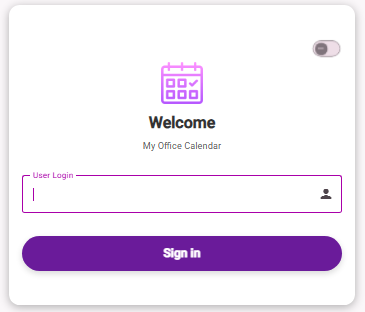
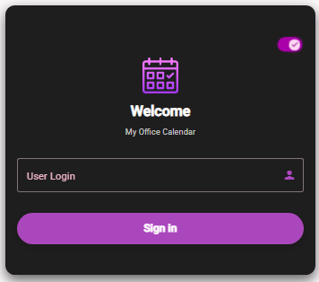
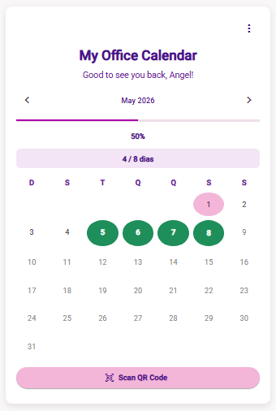
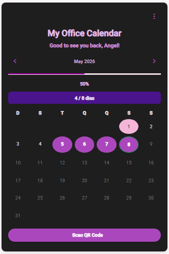
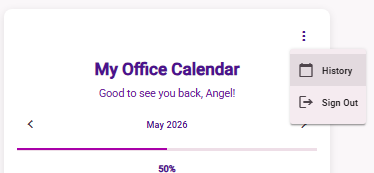
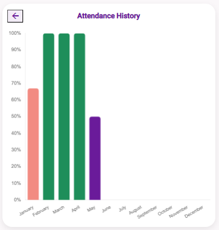

# My Office Calendar

Angular application created to manage office attendance and presence tracking.

The project allows users to visualize a monthly calendar, mark office presence, and track attendance history.


## ✨ Features

- Monthly calendar view
- Office presence marking
- Attendance percentage tracking
- Presence history visualization
- Local storage data persistence
- Responsive layout for desktop and mobile

## 🛠️ Tech Stack

- Angular
- TypeScript
- Angular Material
- HTML5 / CSS3
- Chart.js
- LocalStorage

## 🚀 Getting Started

```bash
npm install
ng serve
```

## 📸 Screenshots












``
